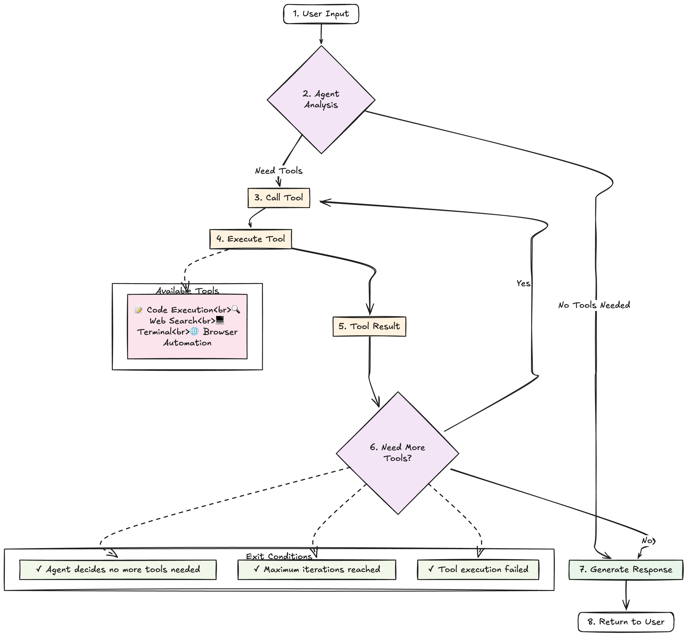

# Open ChatGPT Agent

A comprehensive replication of the OpenAI ChatGPT agent featuring standardized AI model interfaces, browser automation via MCP (Model Context Protocol), terminal toolkit, and web search capabilities.



## 🚀 Features

### 🧠 Multi-Model AI Support
- **Anthropic Claude** (claude-sonnet-4-20250514)
- **OpenAI GPT** (gpt-4, gpt-4-turbo)
- **Google Gemini** (gemini-2.5-pro)
- Standardized interface for easy model switching

### 🌐 Browser Automation (MCP Integration)
- Web page navigation and interaction via MCP servers
- Form filling and button clicking
- Screenshot capture and visual analysis
- DOM element manipulation
- Support for multiple browser automation backends:
  - `@co-browser/browser-use-mcp` (recommended)
  - `@modelcontextprotocol/server-puppeteer`
  - Local Playwright servers

### 💻 Terminal Toolkit
- Command execution in various shells (bash, zsh, sh)
- File system operations
- Process management
- Environment variable handling
- Configurable working directories

### 🔍 Web Search & Content
- Web search via Exa API
- Content fetching and parsing
- Real-time information retrieval
- Result filtering and ranking
- Markdown conversion for LLM processing

### 📝 Code Execution
- Python, Bash, and R code execution
- Subprocess isolation with timeout
- Output capture and error handling
- Matplotlib figure support

## 🔧 Prerequisites

- **Python 3.8+**
- **Node.js 18+** (for MCP browser tools)
- **API Keys**:
  - At least one AI provider (Anthropic, OpenAI, or Google)
  - Exa API key for web search

## 📦 Installation

### 1. Clone and Setup Environment

```bash
git clone https://github.com/your-username/open-chatgpt-agent.git
cd open-chatgpt-agent

# Create virtual environment
python -m venv venv
source venv/bin/activate  # On Windows: venv\Scripts\activate

# Install Python dependencies
pip install -r requirements.txt
```

### 2. Configure Environment

```bash
# Copy environment template
cp .env.example .env

# Edit .env with your API keys
nano .env  # or use your preferred editor
```

### 3. Install MCP Browser Tools (Optional)

```bash
# Run the setup script
./setup_mcp_browser.sh

# Or manually install
npm install -g @co-browser/browser-use-mcp
npm install -g @modelcontextprotocol/server-puppeteer
```

## ⚙️ Configuration

### Environment Variables (.env)

```env
# AI Model API Keys (at least one required)
ANTHROPIC_API_KEY=your_anthropic_key
OPENAI_API_KEY=your_openai_key
GEMINI_API_KEY=your_gemini_key

# Web Search
EXA_API_KEY=your_exa_key

# Model Configuration
DEFAULT_MODEL_PROVIDER=anthropic
DEFAULT_MODEL_NAME=claude-sonnet-4-20250514
DEFAULT_TEMPERATURE=0.7
DEFAULT_MAX_TOKENS=4096

# Agent Configuration
ENABLE_LOGGING=true
LOG_LEVEL=INFO
SESSION_LOG_DIR=./logs

# MCP Configuration
ENABLE_MCP=true
MCP_BROWSER_SERVER=browser_use
MCP_BROWSER_COMMAND=npx
MCP_BROWSER_ARGS=@co-browser/browser-use-mcp

# Tool Configuration
ENABLE_CODE_EXECUTION=true
ALLOWED_CODE_TYPES=python,bash,r
CODE_EXECUTION_TIMEOUT=60

TERMINAL_SHELL=bash
TERMINAL_TIMEOUT=10000
TERMINAL_WORKING_DIR=./workspace
```

## 🚀 Quick Start

### Method 1: Quick Demo (Recommended for first-time users)

```bash
# Set your API key (choose one)
export ANTHROPIC_API_KEY="your_key_here"
# export OPENAI_API_KEY="your_key_here"  
# export GEMINI_API_KEY="your_key_here"

# Run the quick demo
python quick_start.py
```

### Method 2: Full Setup

```bash
# 1. Copy and configure environment
cp .env.example .env
# Edit .env with your API keys

# 2. Run the main program
python main.py
```

### Method 3: Programming Usage

```python
from src.agent import ChatGPTAgent
from src.utils.config import config

# Check configuration status
config.print_config_status()

# Initialize agent
agent = ChatGPTAgent(
    model_provider="anthropic",  # or "openai", "gemini"
    model_name="claude-sonnet-4-20250514",
    enable_mcp=True  # Enable browser automation
)

# Start conversation
response = await agent.chat("Help me search for the latest AI news and summarize it")
print(response)
```

### Multi-Model Support

```python
# Switch between different AI providers
claude_agent = ChatGPTAgent(model_provider="anthropic")
gpt_agent = ChatGPTAgent(model_provider="openai", model_name="gpt-4")
gemini_agent = ChatGPTAgent(model_provider="gemini", model_name="gemini-2.5-pro")

# The interface is identical across all providers
response = await claude_agent.chat("Explain quantum computing")
```

### Browser Automation

```python
# Enable MCP browser tools
agent = ChatGPTAgent(enable_mcp=True)
await agent.connect_mcp_servers()

# Natural language browser control
await agent.chat("Navigate to https://example.com and take a screenshot")
await agent.chat("Find all links on the page and click the first one")
await agent.chat("Fill out the contact form with test data")
```

### Direct Tool Usage

```python
from src.tools import (
    CodeExecutionTool, 
    WebSearchTool, 
    TerminalTool, 
    BrowserMCPTool,
    MCPClient
)

# Code execution
code_tool = CodeExecutionTool()
result = await code_tool.execute("print('Hello, World!')", code_type="python")

# Web search
search_tool = WebSearchTool()
results = await search_tool.execute("latest AI developments", topn=5)

# Terminal operations
terminal_tool = TerminalTool()
result = await terminal_tool.execute("ls -la")

# Browser automation
mcp_client = MCPClient()
browser_tool = BrowserMCPTool(mcp_client)
await browser_tool.navigate("https://example.com")
await browser_tool.screenshot()
```

## 🧪 Development

### Running Tests

```bash
# Run all tests
pytest

# Run with coverage
pytest --cov=src --cov-report=html

# Run specific test category
pytest tests/test_models.py
pytest tests/test_tools.py -v
```

### Development Setup

```bash
# Install development dependencies
pip install -e .

# Code formatting
black src/ tests/
isort src/ tests/

# Type checking
mypy src/

# Linting
flake8 src/
```

### Configuration Check

```bash
# Check configuration status
python -c "from src.utils.config import config; config.print_config_status()"

# Test MCP browser setup
python examples/browser_mcp_example.py
```


## 🛠️ Available Tools

| Tool | Description | Type | Requirements |
|------|-------------|------|--------------|
| **Code Execution** | Execute Python, Bash, R code | Direct | Python runtime |
| **Web Search** | Search the web via Exa API | Direct | Exa API key |
| **Web Content** | Fetch and parse web content | Direct | Exa API key |
| **Terminal** | Execute shell commands | Direct | Shell access |
| **Browser Automation** | Web automation via MCP | MCP | Node.js, MCP server |

## 🔗 MCP Integration

The Model Context Protocol (MCP) integration allows seamless connection to various external tools and services:

### Supported MCP Servers
- **Browser-use MCP**: Advanced browser automation with dockerized Playwright
- **Puppeteer MCP**: Web automation using Puppeteer
- **Playwright MCP**: Browser automation with Playwright

### MCP Client Features
- Multi-server connection management
- Automatic tool discovery
- Unified tool interface
- Error handling and reconnection
- Server health monitoring

## 📊 Session Management

- **Conversation Tracking**: Complete chat history with tool calls
- **Session Persistence**: JSON-based session logging
- **Multi-session Support**: Concurrent session handling
- **Session Analytics**: Usage metrics and performance tracking

## 🔒 Security & Best Practices

- **API Key Management**: Secure environment variable handling
- **Input Validation**: Comprehensive parameter validation
- **Timeout Controls**: Configurable timeouts for all operations
- **Error Handling**: Graceful error recovery and reporting
- **Resource Management**: Proper cleanup of resources and connections

## 🤝 Contributing

1. Fork the repository
2. Create a feature branch (`git checkout -b feature/amazing-feature`)
3. Commit your changes (`git commit -m 'Add amazing feature'`)
4. Push to the branch (`git push origin feature/amazing-feature`)
5. Open a Pull Request

## 📝 License

This project is licensed under the MIT License - see the [LICENSE](LICENSE) file for details.

## 🙏 Acknowledgments

- **OpenAI** for the ChatGPT agent demonstration
- **Anthropic** for Claude AI and MCP protocol
- **Model Context Protocol** community for standardization
- **Open source contributors** for various tools and libraries

---

**Note**: This is a replication project for educational and research purposes. Please respect OpenAI's terms of service and use responsibly.